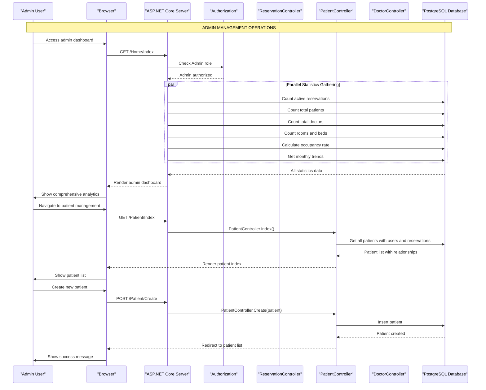

# BedAutomation - Sequence Diagramları

Bu dosya BedAutomation hastane otomasyon sistemi için detaylı sequence diagramlarını içerir.

## 1. Kimlik Doğrulama ve Rol Atama

## 2. Hasta Profil Oluşturma

## 3. Rezervasyon Oluşturma

## 4. Admin Yönetim İşlemleri

## 5. Doktor İşlemleri

## 6. Hasta Self-Servis

---

## Sistem Mimarisi Özeti

### Teknoloji Stack:
- **Framework**: ASP.NET Core 9 MVC
- **Database**: PostgreSQL + Entity Framework Core
- **Authentication**: ASP.NET Core Identity
- **UI**: Bootstrap 5 + Modern CSS

### Ana Roller:
- **Admin**: Tam sistem yönetimi
- **Doctor**: Tıbbi işlemler ve hasta yönetimi
- **Patient**: Self-servis ve rezervasyon yönetimi

### Güvenlik:
- Role-based authorization
- User-specific data access
- Authentication middleware
- Data validation

Bu diagramlar projenin tüm ana akışlarını göstermektedir. 