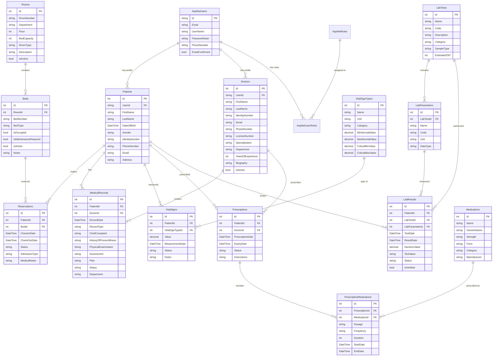
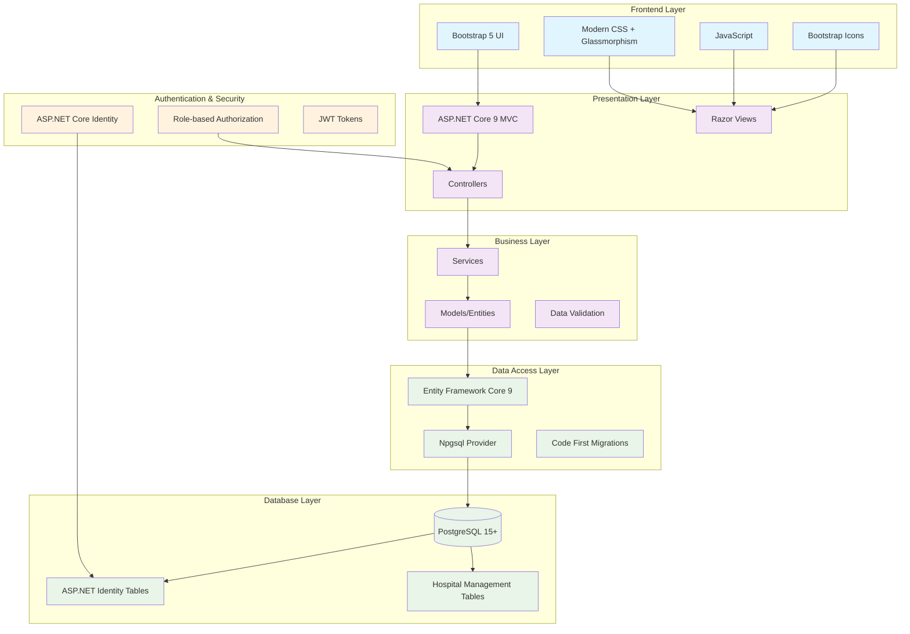

# 🏥 BedAutomation - Hospital Management System

Modern web tabanlı hastane yönetim sistemi. ASP.NET Core 9 MVC ve PostgreSQL kullanılarak geliştirilmiştir.

## 📋 İçindekiler

- [Teknoloji Stack](#-teknoloji-stack)
- [Özellikler](#-özellikler)
- [Database Şeması](#-database-şeması)
- [ER Diyagramı](#-er-diyagramı)
- [Sistem Mimarisi](#️-sistem-mimarisi)
- [Kullanıcı Rolleri](#-kullanıcı-rolleri)
- [Kullanıcı Rol Hiyerarşisi](#-kullanıcı-rol-hiyerarşisi)
- [Test Kullanıcıları](#-test-kullanıcıları)
- [Kurulum](#-kurulum)
- [Kullanım](#-kullanım)
- [Database İstatistikleri](#-database-i̇statistikleri)
- [Gelecek Geliştirmeler](#-gelecek-geliştirmeler)

## 🚀 Teknoloji Stack

### Backend
- **Framework**: ASP.NET Core 9 MVC
- **Database**: PostgreSQL 15+
- **ORM**: Entity Framework Core 9.0
- **Authentication**: ASP.NET Core Identity
- **Database Provider**: Npgsql.EntityFrameworkCore.PostgreSQL 9.0.0

### Frontend
- **UI Framework**: Bootstrap 5
- **Icons**: Bootstrap Icons
- **Styling**: Modern CSS with CSS Variables
- **Typography**: Inter Font Family
- **Design**: Glassmorphism & Gradient Effects

### Architecture
- **Pattern**: Model-View-Controller (MVC)
- **Database First**: Code First Migration
- **Dependency Injection**: Built-in ASP.NET Core DI
- **Authentication**: Role-based Authentication

## ✨ Özellikler

### 👤 Kullanıcı Yönetimi
- Role-based authentication (Admin, Doctor, Patient)
- Modern login/register pages
- Profile management
- Automatic role assignment

### 🏥 Hastane Yönetimi
- **Room Management**: Department-based room organization
- **Bed Management**: Real-time bed occupancy tracking
- **Patient Management**: Comprehensive patient profiles
- **Doctor Management**: Specialist profiles with departments

### 📊 Tıbbi Kayıtlar
- **Medical Records**: Patient consultation records
- **Vital Signs**: Multi-parameter vital sign tracking
- **Prescriptions**: Medication management system
- **Lab Results**: Laboratory test management

### 📅 Rezervasyon Sistemi
- Bed reservation management
- Check-in/Check-out tracking
- Status management (Active, Completed, Cancelled)
- Medical notes integration

## 🗄️ Database Şeması

### Core Entities

#### 👥 User Management
```sql
AspNetUsers (Identity)
├── AspNetUserRoles
├── AspNetRoles
├── Patients
└── Doctors
```

#### 🏢 Hospital Infrastructure
```sql
Rooms
├── BedCapacity: int
├── Department: string
├── Floor: int
└── RoomType: string

Beds
├── BedNumber: string
├── BedType: string
├── IsOccupied: bool
├── RoomId: FK
└── IsMaintenanceRequired: bool
```

#### 📋 Medical System
```sql
MedicalRecords
├── PatientId: FK
├── DoctorId: FK
├── RecordType: string
├── ChiefComplaint: string
├── HistoryOfPresentIllness: string
├── PhysicalExamination: string
├── Assessment: string
├── Plan: string
└── Department: string

VitalSigns
├── PatientId: FK
├── VitalSignTypeId: FK
├── Value: decimal
├── MeasurementDate: DateTime
├── Status: string
└── Notes: string

VitalSignTypes
├── Name: string (Temperature, Heart Rate, etc.)
├── Unit: string
├── Category: string
├── MinNormalValue: decimal
├── MaxNormalValue: decimal
├── CriticalMinValue: decimal
└── CriticalMaxValue: decimal
```

#### 💊 Medication & Lab System
```sql
Prescriptions
├── PatientId: FK
├── DoctorId: FK
├── PrescriptionDate: DateTime
├── ExpiryDate: DateTime
├── Status: string
└── Instructions: string

PrescriptionMedications
├── PrescriptionId: FK
├── MedicationId: FK
├── Dosage: string
├── Frequency: string
├── Duration: int
├── StartDate: DateTime
└── EndDate: DateTime

Medications
├── Name: string
├── GenericName: string
├── Strength: string
├── Form: string (Tablet, Capsule, etc.)
├── Category: string
└── Manufacturer: string

LabResults
├── PatientId: FK
├── LabTestId: FK
├── LabParameterId: FK
├── TestDate: DateTime
├── ResultDate: DateTime
├── NumericValue: decimal
├── TextValue: string
├── Status: string (Normal, Abnormal, Critical)
└── IsVerified: bool

LabTests
├── Name: string (CBC, BMP, etc.)
├── Code: string
├── Description: string
├── Category: string
├── SampleType: string
└── EstimatedTAT: int

LabParameters
├── LabTestId: FK
├── Name: string (WBC, RBC, etc.)
├── Code: string
├── Unit: string
└── DataType: string
```

#### 🛏️ Reservation System
```sql
Reservations
├── PatientId: FK
├── BedId: FK
├── CheckInDate: DateTime
├── CheckOutDate: DateTime
├── Status: string
├── AdmissionType: string
└── MedicalNotes: string
```

## 🔄 ER Diyagramı



## 👥 Kullanıcı Rolleri

### 🔧 Admin
- **Yetkileri**: Tam sistem yönetimi
- **Erişim**: Tüm modüller ve yönetim paneli
- **Özellikler**:
  - Kullanıcı yönetimi
  - Sistem ayarları
  - Oda ve yatak yönetimi
  - Raporlama

### 👨‍⚕️ Doctor (Doktor)
- **Yetkileri**: Tıbbi kayıt yönetimi
- **Erişim**: Hasta kayıtları, reçete yazma, lab sonuçları
- **Özellikler**:
  - Hasta muayene kayıtları
  - Reçete yazma
  - Vital signs takibi
  - Lab sonuçları görüntüleme

### 🤒 Patient (Hasta)
- **Yetkileri**: Kendi profil ve kayıtları
- **Erişim**: Kişisel tıbbi kayıtlar, rezervasyonlar
- **Özellikler**:
  - Kendi tıbbi geçmişi
  - Rezervasyon geçmişi
  - Reçete görüntüleme
  - Lab sonuçları

## 🏗️ Sistem Mimarisi



## 🎯 Kullanıcı Rol Hiyerarşisi

```mermaid
graph TD
    subgraph "System Users"
        ADMIN[👨‍💼 Admin<br/>admin@hospital.com]
        DOC1[👨‍⚕️ Dr. Mehmet Özkan<br/>Cardiology<br/>dr.mehmet@hospital.com]
        DOC2[👩‍⚕️ Dr. Ayşe Yıldırım<br/>Neurology<br/>dr.ayse@hospital.com]
        PAT1[🤒 Ahmet Yılmaz<br/>Male, 1985<br/>patient1@email.com]
        PAT2[🤒 Elif Kaya<br/>Female, 1992<br/>patient2@email.com]
        PAT3[🤒 Mustafa Demir<br/>Male, 1978<br/>patient3@email.com]
        PAT4[🤒 Zehra Şahin<br/>Female, 1996<br/>patient4@email.com]
    end
    
    subgraph "Permissions & Access"
        ADMIN_PERM[🔧 Full System Access<br/>• User Management<br/>• System Settings<br/>• All Modules<br/>• Reports]
        DOC_PERM[👨‍⚕️ Medical Access<br/>• Medical Records<br/>• Prescriptions<br/>• Lab Results<br/>• Vital Signs]
        PAT_PERM[🤒 Personal Access<br/>• Own Medical History<br/>• Own Reservations<br/>• Own Prescriptions<br/>• Own Lab Results]
    end
    
    subgraph "System Modules"
        USER_MGT[User Management]
        ROOM_MGT[Room & Bed Management]
        MED_REC[Medical Records]
        PRESCR[Prescriptions]
        LAB_RES[Lab Results]
        VITAL[Vital Signs]
        RESERV[Reservations]
        REPORTS[Reports]
    end
    
    ADMIN --> ADMIN_PERM
    DOC1 --> DOC_PERM
    DOC2 --> DOC_PERM
    PAT1 --> PAT_PERM
    PAT2 --> PAT_PERM
    PAT3 --> PAT_PERM
    PAT4 --> PAT_PERM
    
    ADMIN_PERM --> USER_PERM
    ADMIN_PERM --> ROOM_MGT
    ADMIN_PERM --> MED_REC
    ADMIN_PERM --> PRESCR
    ADMIN_PERM --> LAB_RES
    ADMIN_PERM --> VITAL
    ADMIN_PERM --> RESERV
    ADMIN_PERM --> REPORTS
    
    DOC_PERM --> MED_REC
    DOC_PERM --> PRESCR
    DOC_PERM --> LAB_RES
    DOC_PERM --> VITAL
    
    PAT_PERM --> MED_REC
    PAT_PERM --> PRESCR
    PAT_PERM --> LAB_RES
    PAT_PERM --> VITAL
    PAT_PERM --> RESERV
    
    classDef admin fill:#ff9999
    classDef doctor fill:#99ccff
    classDef patient fill:#99ff99
    classDef permission fill:#ffcc99
    classDef module fill:#cc99ff
    
    class ADMIN admin
    class DOC1,DOC2 doctor
    class PAT1,PAT2,PAT3,PAT4 patient
    class ADMIN_PERM,DOC_PERM,PAT_PERM permission
    class USER_MGT,ROOM_MGT,MED_REC,PRESCR,LAB_RES,VITAL,RESERV,REPORTS module
```



## 🔑 Test Kullanıcıları

### Admin Hesabı
```
Email: admin@hospital.com
Password: Admin123!
Role: Admin
```

### Doktor Hesapları
```
🩺 Dr. Mehmet Özkan (Cardiology)
Email: dr.mehmet@hospital.com
Password: Doctor123!
Phone: +905329998877
License: DOC123456
Experience: 15 years

🧠 Dr. Ayşe Yıldırım (Neurology)  
Email: dr.ayse@hospital.com
Password: Doctor123!
Phone: +905337776655
License: DOC789012
Experience: 12 years
```

### Hasta Hesapları
```
👨 Ahmet Yılmaz (1985, Male)
Email: patient1@email.com
Password: Patient123!
Phone: +905321234567
Identity: 12345678901

👩 Elif Kaya (1992, Female)
Email: patient2@email.com  
Password: Patient123!
Phone: +905339876543
Identity: 98765432109

👨 Mustafa Demir (1978, Male)
Email: patient3@email.com
Password: Patient123!
Phone: +905345554433
Identity: 55443322110

👩 Zehra Şahin (1996, Female)
Email: patient4@email.com
Password: Patient123!
Phone: +905351112233
Identity: 11223344556
```

## ⚙️ Kurulum

### Ön Gereksinimler
- .NET 9 SDK
- PostgreSQL 15+
- Visual Studio 2022 veya VS Code

### 1. Projeyi Klonlama
```bash
git clone <repository-url>
cd BedAutomation
```

### 2. Database Kurulumu
```bash
# PostgreSQL bağlantı stringini appsettings.json'da güncelleyin
# ConnectionStrings -> DefaultConnection

# Database migration
dotnet ef database update
```

### 3. Dependency Yükleme
```bash
dotnet restore
```

### 4. Uygulamayı Başlatma
```bash
dotnet run
# veya
dotnet watch
```

### 5. Test Verileri
Uygulama ilk çalıştırıldığında otomatik olarak test verileri oluşturulur:
- 6 kullanıcı (1 admin, 2 doktor, 4 hasta)
- 8 oda, 14 yatak
- Tıbbi kayıtlar, rezervasyonlar, ilaçlar
- Lab testleri ve sonuçları
- Vital signs verileri

## 🎯 Kullanım

### Sisteme Giriş
1. Ana sayfaya gidin: `https://localhost:5001`
2. "Login" butonuna tıklayın
3. Test kullanıcı bilgileri ile giriş yapın

### Admin Paneli
- Tüm modüllere erişim
- Kullanıcı ve sistem yönetimi
- Raporlama özellikleri

### Doktor Paneli
- Hasta kayıtları görüntüleme
- Yeni muayene kayıtları oluşturma
- Reçete yazma
- Lab sonuçları değerlendirme

### Hasta Paneli
- Kişisel tıbbi geçmiş
- Rezervasyon durumu
- Reçete ve lab sonuçları

## 🎨 UI/UX Özellikleri

### Modern Tasarım
- **Glassmorphism Effects**: Şeffaflık ve blur efektleri
- **Gradient Backgrounds**: Modern renk geçişleri
- **Responsive Design**: Mobil uyumlu tasarım
- **Bootstrap Icons**: Tutarlı ikonografi

### Renk Paleti
```css
:root {
    --primary: #6366f1;
    --secondary: #64748b;
    --success: #10b981;
    --danger: #ef4444;
    --warning: #f59e0b;
    --info: #06b6d4;
    --light: #f8fafc;
    --dark: #0f172a;
}
```

### Typography
- **Font Family**: Inter (Google Fonts)
- **Font Weights**: 300, 400, 500, 600, 700
- **Responsive Font Sizes**: Fluid typography

## 📊 Database İstatistikleri

### Test Verileri
- **Kullanıcılar**: 6 (1 admin, 2 doktor, 4 hasta)
- **Odalar**: 8 (3 Cardiology, 3 Neurology, 2 Orthopedics)
- **Yataklar**: 14 (Standard, VIP, ICU)
- **Rezervasyonlar**: 3 (Active ve Completed)
- **Tıbbi Kayıtlar**: 2 (Cardiology ve Neurology)
- **Vital Signs**: 42 ölçüm (7 gün x 3 hasta x 2 parametre)
- **Reçeteler**: 2 aktif reçete
- **Lab Sonuçları**: 2 test sonucu
- **İlaçlar**: 8 çeşit ilaç
- **Lab Testleri**: 6 test türü (CBC, BMP, Lipid, LFT, UA, TFT)

## 🎯 Gelecek Geliştirmeler

- **E-Reçete Sistemi**: Online reçete yazma ve dağıtma
- **Telefon Uygulaması**: Mobil uygulama desteği
- **Bilgi Tabanı**: Tıbbi bilgi ve kaynakları
- **İletişim Platformu**: Hastane iletişim platformu
