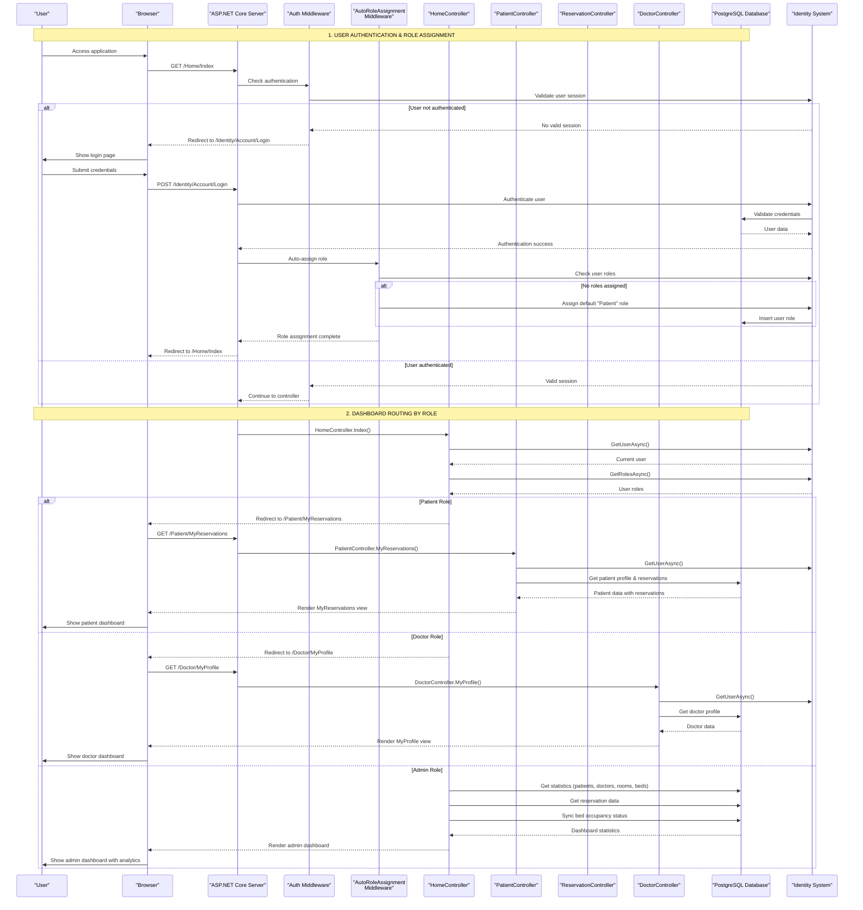
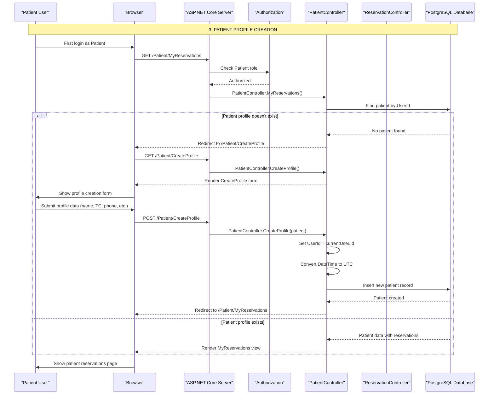
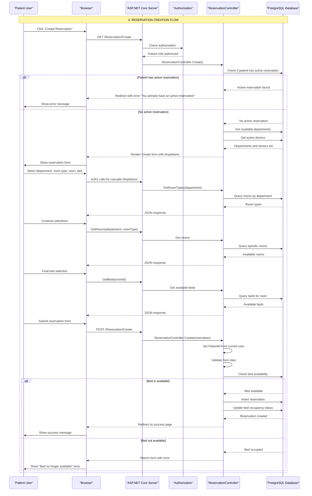
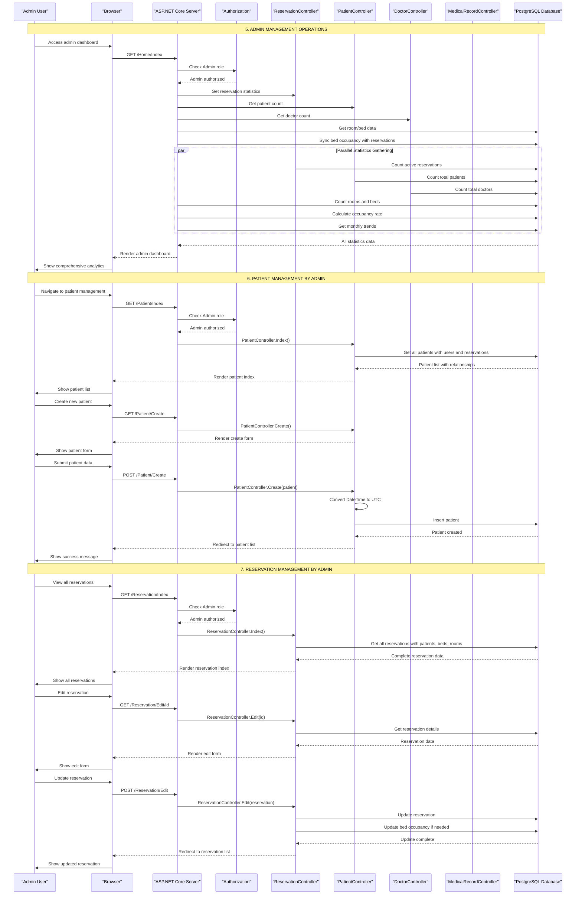
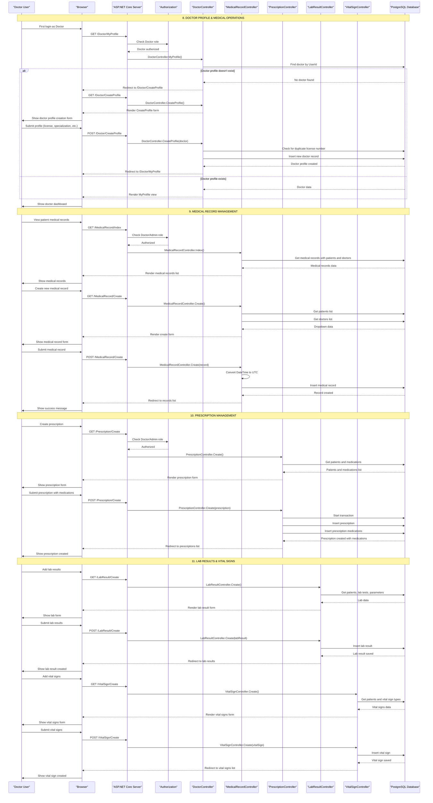
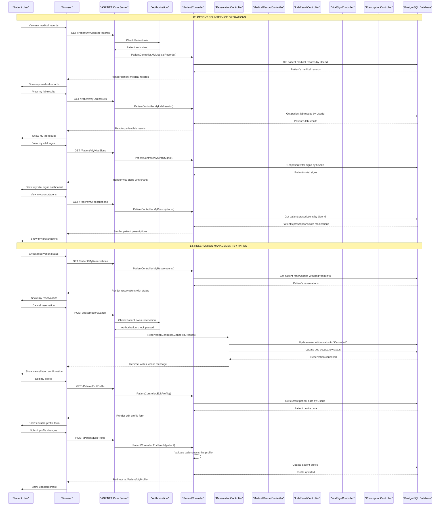

# BedAutomation - Sequence Diagramları

Bu dosya BedAutomation hastane otomasyon sistemi için detaylı sequence diagramlarını içerir.

## 📋 İçindekiler

1. [Kimlik Doğrulama ve Rol Atama](#1-kimlik-doğrulama-ve-rol-atama)
2. [Hasta Profil Oluşturma](#2-hasta-profil-oluşturma)
3. [Rezervasyon Oluşturma](#3-rezervasyon-oluşturma)
4. [Admin Yönetim İşlemleri](#4-admin-yönetim-işlemleri)
5. [Doktor İşlemleri](#5-doktor-işlemleri)
6. [Hasta Self-Servis](#6-hasta-self-servis)

---

## 1. Kimlik Doğrulama ve Rol Atama

---

## 2. Hasta Profil Oluşturma

---

## 3. Rezervasyon Oluşturma

---

## 4. Admin Yönetim İşlemleri

---

## 5. Doktor İşlemleri

---

## 6. Hasta Self-Servis

---

## 📊 Sistem Mimarisi Özeti

### **Teknoloji Stack:**
- **Framework**: ASP.NET Core 9 MVC
- **Database**: PostgreSQL + Entity Framework Core
- **Authentication**: ASP.NET Core Identity
- **UI**: Bootstrap 5 + Modern CSS + Bootstrap Icons
- **Pattern**: MVC (Model-View-Controller)

### **Güvenlik Katmanları:**
- **Authentication**: Identity middleware
- **Authorization**: Role-based access control (Admin/Patient/Doctor)
- **Data Protection**: User-specific data access kontrolü
- **Validation**: Model validation ve business rules

### **Ana Akışlar:**
1. **Kimlik Doğrulama**: Otomatik rol atama ile
2. **Profil Yönetimi**: Role-specific profile creation
3. **Rezervasyon Sistemi**: Cascading dropdown ve availability check
4. **Admin Dashboard**: Comprehensive analytics ve management
5. **Tıbbi İşlemler**: Medical records, prescriptions, lab results
6. **Self-Service**: Patient portal functionalities

### **Veritabanı İlişkileri:**
- Patient ↔ Reservations (One-to-Many)
- Reservation ↔ Bed (Many-to-One)
- Bed ↔ Room (Many-to-One)
- Doctor ↔ Reservations (One-to-Many)
- Patient ↔ MedicalRecords (One-to-Many)
- MedicalRecord ↔ Diagnoses (One-to-Many)

Bu sequence diagramları projenizin tam işleyişini gösteriyor ve PNG'ye çevirmek için kullanabilirsiniz.
